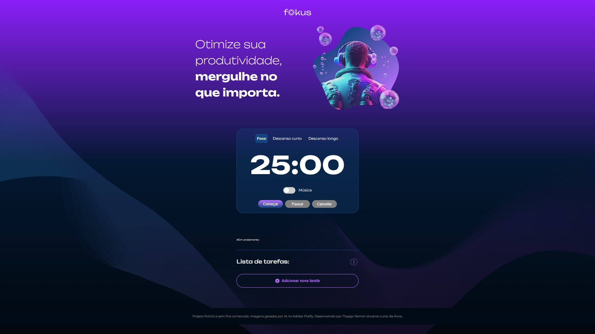

# Fokus - aplicação de Técnica Pomodoro

Fokus é uma aplicação que auxilia o usuário a aplicar a técnica Pomodoro em seu dia-a-dia.



[Clique aqui acessara aplicação](https://thyagoramon.github.io/)

## Sobre a Técnica Pomodoro:
É uma técnica de gerenciamento de tempo que visa aumentar a produtividade através da divisão do trabalho em blocos de tempo focados, separados por intervalos regulares. Para aplicar a técnica, uma pessoa deve trabalha por 25 minutos (um "pomodoro") focando na conclusão de uma tarefa, após esse tempo, faz-se uma pausa de 5 minutos e em seguida inicia outro pomodoro (25 minutos de trabalho). Após quatro "pomodoros", faz-se uma pausa longa, de 15 a 30 minutos.

## Sobre o projeto:
Este é um projeto de front-end desenvolvido ao longo da formação `Desenvolvimento Front-end: cursos para criar aplicações web com HTML, CSS e JavaScript` da escola de tecnologia Alura. A estrutra HTML e estilização em CSS foi fornecida já desenvolvida, mas todas as funcionalidades interativas foi desenvolvida por mim usando JavaScript.

## Funcionalidades da aplicação:
- `Escolha do modo - ou fase - pomodoro:` o usuário pode alternar entre o modo Foco, Descanso curto e Descanso longo. Ao mudar de modo a aparencia da página muda, como também o tempo do contador regressivo.
- `Contador Regressivo:` contador regressivo com tempo pre-definidos para cada fase da Técnica Pomodoro. O usuário tem as opções de iniciar, pausar e cancelar a contagem.
- `Música:` O usuáio pode reproduzir, através de um checkbox, uma música ambiente para auxiliar na aplicação da técnica.
- `Lista de tarefas:` O usuário pode listar as tarefas que deve realizar, podendo escolher uma como "tarefa em andamento", a qual o usuário tentará realizar durante um periodo de foco. As tarefas são salvas em LocalStorage, e o usuário tem as opções de adicionar, editar e excluir tarefas.

## Técnicas e tecnologias utilizadas:
- `HTML` - Para estrutura e marcação dos elementos da página.
- `CSS` - Para estilização dos elementos da página.
- `JavaScript` - Para programação de funcionalidades interativas.
- `Figma` - Para prototipagem do projeto.

## Soluções aplicadas no código:
Neste projeto busquei centralizar o controle das funcionalidades usando um "sistema de estados", veja o exemplo abaixo:
```
btnStart.addEventListener('click', () => {
	pomodoroStatus = 'ativo';
	atualizarEstado();
});
```

O código acima é o listener do botão que inicia o contador regressivo do pomodoro, ele apenas defini a string `ativo` na variável `pomodoroStatus`, e chama a função `atualizarEstado`. A função atualizarEstado() é o núcleo de controle do timer Pomodoro. Ela centraliza toda a lógica relacionada às mudanças de estado da aplicação — como iniciar, pausar, cancelar ou finalizar uma contagem. A partir do valor da variável `pomodoroStatus`, essa função atualiza os botões da interface, gerencia o cronômetro, executa os sons correspondentes e reseta o tempo quando necessário. Com isso, garante que todos os comportamentos do timer fiquem organizados e consistentes em um único lugar, facilitando a manutenção e a expansão do projeto.

Segue um trecho do código que mostra o estado `ativo`, usado quando o contador regressivo está em execução:
```
case 'ativo':
	//botões
		desativarBtn(btnStart);
		ativarBtn(btnPause);
		ativarBtn(btnCancel);
		btnStart.innerText = 'Continuar';
	//sons
		audioPlay.play();
	//cronómetro
		contagem = setInterval(contadorRegressivo, 1000); //executa a contagem
	break;
```
 